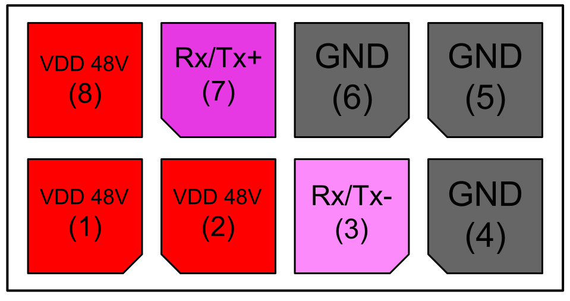
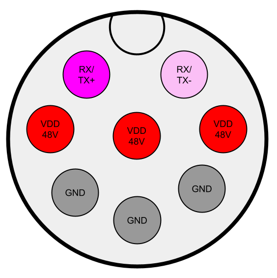
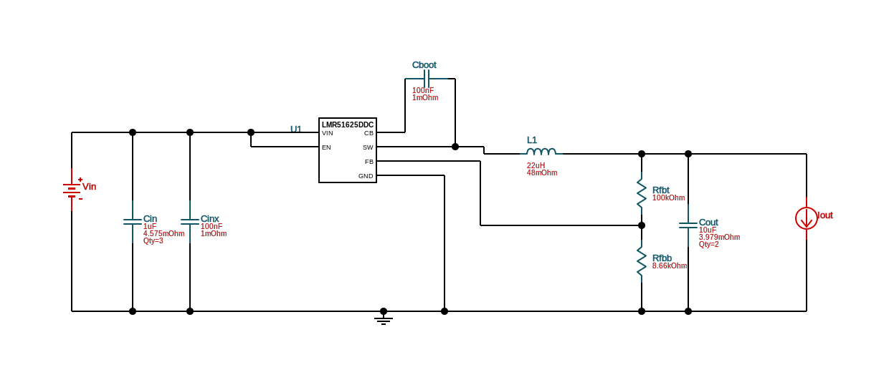
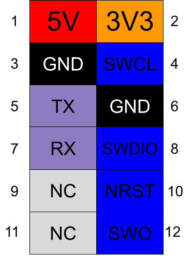
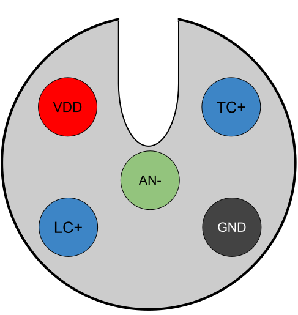

*
 Written by Vikram Procter | Sept 13, 2025 
*

# SOAR - Launch Rail Board Specs

## Purpose Overview
- Use AFEs to convert analog sensor data to digital
- Sensors include load cells, thermocouples and anemometers
- Interface with Fill Systems Board (FSB) in Rocket Control Unit (RCU) to provide digital sensor data using UART over Serial RS485
- This board exists on the Launch Rail and is in IP rated box
- The board should also store sensor data to flash memory
- Replacing the Signal Observations Board (SOB) from Ouroboros

## TODO
- ~~Find FSB connector~~
- ~~Define FSB connector wiring standard~~
- ~~Connector ESD Protection~~
- ~~Figure out Reset Button, and buzzer~~
- ~~I2C pull ups please~~
- ~~Figure out how to do USB vs FSB power supply switching (ORing LM66100)~~
- ~~Add indicator LEDs (Power, USB power, MCU debug)~~
- ~~Mounting holes~~
- ~~Find external LED indicators connector wire assembly~~
- Box edge LED indicators
- ~~Fix inductor to have larger current max~~
- Add lots of silkscreen
    - ~~Sensor types~~
    - ~~label R31 as a jumper to ground~~
    - ~~Your name (maybe in copper)~~
    - ~~Description~~
    - ~~JLCJCLJLC add to silk screen for tracking number~~
    - ~~Shorten Thermo couple name~~
    - ~~Add rocket name~~
- ~~Fix 5V Power source ORing for programming header~~
- ~~Fix MCU debug LEDs to use fet~~
- ~~Swap USB-C to through hole footprint~~

## Design Review
- [Review Google Doc](https://docs.google.com/document/d/1Cs_T_aiDTq1XPzXbdogT7vXFGTcwQEdisFsmFb62IeU/edit?usp=sharing)

## FSB Connection
### Data Transfer
-   Run simplexed UART over RS-485 twisted pairs
-   Using [Digital to RS485 serial converter](https://www.digikey.ca/en/products/detail/texas-instruments/SN65HVD72D/3283549)

### Power Supply
-   FSB provides 48V

### Connector Choice
-   Board to Wire Molex header [0430450800](https://www.digikey.ca/en/products/detail/molex/0430450800/252529)
-   Board to side panel edge cable assembly [2147561082](https://www.molex.com/en-us/products/part-detail/2147561082), [digikey](https://www.digikey.ca/en/products/detail/molex/2147561082/12180697?s=N4IgTCBcDa4IwBYDsBWAbHADADggXQF8g)

-   These are pin numbers based on schematic  

-   Maybe panel Edge connector: M12, 8 position circular connector [54-00184](https://www.digikey.ca/en/products/detail/tensility-international-corp/54-00184/13548494)
-   panel exterior cable 5m Cable [M12A08MR-12AMR-SD005](https://www.digikey.ca/en/products/detail/amphenol-ltw/M12A08MR-12AMR-SD005/21315761)

### RS485 to Digital IC
-   Two [SN65HVD72D](https://www.digikey.ca/en/products/detail/texas-instruments/SN65HVD72D/3283549) ICs will be used to allow for full duplex
-   Each will be used for only Rx or Tx
-   The Tx SN65HVD72D has the DE and RE bar pins held high for driver enable
-   The Rx SN65HVD72D has the DE and RE bar pins held high for receiver enable
-   The connector wires for RS485 will not be connected to ESD protection devices as the SN65HVD72D has built in esd protection

## Power Regulation
-   48V input power stepped down to 10V using Buck converter
-   Power indicator LEDs use [AL5809-20S1-7](https://www.digikey.ca/en/products/detail/diodes-incorporated/AL5809-20S1-7/5030204) for current limiting
### Buck Converter [LMR51625XDDCR](https://www.digikey.ca/en/products/detail/texas-instruments/LMR51625XDDCR/25991371)
- Configuration provided by [Webench SVG](https://webench.ti.com/power-designer/switching-regulator/select) and Ultium Design
- Vout=10V, f=400kHz, Voutpk=18mV, Iout=2A 
- For 10V: $\frac{R_{FBT}}{R_{FBB}}=\frac{V_{out}-0.8}{0.8}=11.5$,
- $R_{FBT}=100k\Omega$ $R_{FBB}=8.66k\Omega$

### LDO Regulator [MIC5209YM](https://www.digikey.ca/en/products/detail/microchip-technology/MIC5209YM/771747)
- For output voltage $V_{out}=1.242V\times(1+\frac{R2}{R1})$ where $R2<470k\Omega$
- For 5V: $\frac{R2}{R1}=3.0257=\frac{453\Omega}{150\Omega}=\frac{47.5k}{15.8k}$
- For 3V3: $\frac{R2}{R1}=1.657=\frac{750\Omega}{453\Omega}=\frac{75k\Omega}{45.3k\Omega}$
- Two caps on output is for ultra low noise, one is optional along with 470pF
### Power Supply Priority
- Allow switching between 5V from USB, programming header, and FSB power, this prioritizes FSB power and ignore usb if usb is plugged in while FSB is providing power. But allow USB to power when FSB is not providing power. The programming header supply has lowest priority and will only be used if no other power sources are connected. 
- ORing of sources is achieved using [LM66100DCKR](https://www.digikey.ca/en/products/detail/texas-instruments/LM66100DCKR/10273183) chip
- This chip also does reverse polarity protection
- Each nCE has a very weak pull down to ensure that the CE is not just floating when other power supplies are not connected.
- This weak pull down does mean that when all power supplies are connected 5V is connected to ground through the 220k. Also if all power supplies are connected 5V are occasionally connected to eachother through a 10k.

*
**Power selection truth table:**
*
| FSB 5V | USB 5V | PRGM 5V | FSB_nCE | USB_nCE | PRGM_nCE |
|:------:|:------:|:-------:|:-------:|:-------:|:--------:|
| 0|0|0  | 0w|0w|0w|
| 0|0|1  | 0 | 1|0w|
| 0|1|0  | 1 |0st|1|
| 0|1|1  | 1 |0st|1|
| 1|0|0  | 0 |1|1fsb|
| 1|0|1  | 0 |1|1fsb|
| 1|1|0  | 0 |1|1fsb|
| 1|1|1  | 0 |1|1fsb|

## Programming Header
Use 12 pin keyed 2.54mm molex connector [0702461201](https://www.digikey.ca/en/products/detail/molex/0702461201/760167) for Serial Wire Debug Programming protocol 
-   Should be compatible with connector bellow or just free wires
-   Keyed Connector [0022552122](https://www.digikey.ca/en/products/detail/molex/0022552122/313630?s=N4IgTCBcDa5grPMBGMEC6BfIA) and crimps [0016020074](https://www.digikey.ca/en/products/detail/molex/0016020074/4838840?s=N4IgTCBcDaIIwDYAMYlIOwBYQF0C%2BQA) or [0016020069](https://www.digikey.ca/en/products/detail/molex/0016020069/1656191?s=N4IgTCBcDaIIwDYAMYlIQThAXQL5A) based on wire gauge
-   Include reset button
-   3V3 is purposefully not connected to 3V3 on board.

## Sensors
### What Sensors:
- 1x [Anemometer](): Analog input, connected to MCU ADC.
    - [Adafruit](https://www.adafruit.com/product/1733?srsltid=AfmBOor_Ywvu-j-peoAsiU7YbtJCmZtmGhgEJ9A_gKxrkaFAT5jR3P_o): $44.95 three wire interface (pwr, gnd, signal)
    - [AliExpress](https://www.aliexpress.com/item/1005009826264755.html): $14.08 RS-485 differential pair, I think
    - [Amazon](https://www.amazon.ca/Environment-Anemometer-Greenhouses-Environmental-Stations-ect/dp/B0867KJBCZ/): $46.89 Very similar to ali express, or 4 wire interface. 
- 3x [Thermocouples](): Using [AFE](https://www.digikey.ca/en/products/detail/analog-devices-inc-maxim-integrated/MAX31856MUD/5050138) with SPI output 
- 2x [Load Cells](): Using [AFE](https://www.digikey.ca/en/products/detail/nuvoton-technology-corporation/NAU7802SGI/2769782) with I2C output

### Sensor Connectors:
-   M12 screw, 5 position circular board to wire connector [54-00247](https://www.tensility.com/products/54-00247), [digikey](https://www.digikey.ca/en/products/detail/tensility-international-corp/54-00247/13548445)
-   Wire assembly [50-00960](https://www.tensility.com/products/50-00960), [digikey](https://www.digikey.ca/en/products/detail/tensility-international-corp/50-00960/13548425)

-   VDD (Pin 1): Provided to only the Load Cell (LC)
-   TC+/LC+ (Pin 2/4): Positive analog signal
-   AN- (Pin 5): Negative Analog signal
-   GND (Pin 3): Ground 

### Data Rate
-	Assume all sensor data is 16bit resolution each + bonus 32bit

## File System Over USB
-   USB C interface with STM to allow the LRB to show up as a mass storage device to offload data
-   If LRB can be powered over USB then that would be good for data offload to not require FSB
-   Using USB FS (no external phys required)
-   Using USB C and USB ab for compatibility, USB C will be conversion of old USB ab

## Flash Memory
-   Targeting 16 bit resolution and 1kHz sampling rate
-   `16bit * 4sensors + 32bonus bits = 96bit/sample `
-   `(96bit/sample)*(1000samples/s)*(1byte/8bits) = 12kB/s`
-   If data measuring is needed for 6 hours, total storage needs to be greater than **259.2MB**, **2073.6Mbit**
-   Using one [(*W25N04KVZEIR*)](https://www.digikey.ca/en/products/detail/winbond-electronics/W25N04KVZEIR/15182086) 4Gbit flash chip
-   Chip uses QuadSPI

## Buzzer
-   Using Same Sky [CMI-1210-5-95T](https://www.digikey.ca/en/products/detail/same-sky-formerly-cui-devices/CMI-1210-5-95T/15904111)
-   Connected to PWM PC0: TIM1, PWM Gen CH1 using NPN [MMBT3904-TP](https://www.digikey.ca/en/products/detail/micro-commercial-co/MMBT3904-TP/717395)

## Microcontroller Specs
### Data Sheet
-   [STM32G491ME
](https://www.st.com/resource/en/datasheet/stm32g491cc.pdf) data sheet

### System and Programming
-   BOOT0 pin is pulled down to GND through 10k, pad are there to change in future
-   Serial Wire Debug Programming protocol is used with NRST pin connected to reset button

### Power Supply
-   Supply voltage 1.71 V to 3.6 V
-   Each VDD pin should have a 100nF decoupling cap
-   VDD should also have one 4.7uF decoupling cap
-   VDDA should have 10nF and 1uF decoupling cap (Pg. 70)
-   VREF+ should be connected to VDDA if VDDA > 2V (Pg. 22)
-   VREF+ should have 100nF and 1uF decoupling cap (Pg. 70)

### Oscillator
-   Using the 32MHz and 9pF oscillator [ABM8-32.000MHZ-B2-T](https://www.digikey.ca/en/products/detail/abracon-llc/ABM8-32-000MHZ-B2-T/2001197)
-   With an Assumed PCB and connector capacitance of Cs=4-6pF
-   Using the equation $C_{L1}=C_{L2}=2*(C_L-C_S)$ ref. [design guide](https://www.st.com/resource/en/application_note/an2867-guidelines-for-oscillator-design-on-stm8afals-and-stm32-mcusmpus-stmicroelectronics.pdf) pg. 12
-   $C_{L1}=C_{L2}=2*(18pF-6pF)=24pF$
-    The STM32G491ME microcontroller specifies that $G_{m,crit}=1.5mA/V$
-   The $G_{m,crit}$ of the oscillator is given by the equation $G_{m,crit}=4*ESR*(2\pi F)^2*(C_0+C_L)^2$
-   This oscillator has a $G_{m,crit}= 4*40\Omega*(2\pi (32MHz))^2*(3pF+18pF)^2$
-   $G_{m,crit}=2.852451478mA/V$
-   For calculating the external resistor ref. [design guide](https://www.st.com/resource/en/application_note/an2867-guidelines-for-oscillator-design-on-stm8afals-and-stm32-mcusmpus-stmicroelectronics.pdf) pg. 16 
-   Given by $R_{ext} = 1/(2\pi F C_{L2})=190to220\Omega$ depending on $C_s$
-   The page cautions that $G_m>>G_{m,crit}=4*(ESR+R_{ext})*(2\pi F)^2*(C_0+C_L)^2=17.11470887mA/V$
-   This oscillator meets the requirements with $C_{L1}=C_{L2}=2*(18pF-7pF)=22pF$ and $R_{ext} = 221\Omega$

### Connectivity
-   Flash Memory interfaces using Quad SPI1
-   Thermo Couples connect to SPI1 and use 9 GPIOs for TC1, TC2, TC3 respectively:
    - CS: PD2, PB6, PD9
    - nDRDY: PB4, PB7, PD8
    - nFault: PD1, PB5, PD10
-   2 Load Cells connect to I2C3
-   Anemometer can use ADC1 in1 in differential mode (PA0:AN+, PA1:AN-)
-   FSB USART connection uses USART 3 with hardware flow control for RS485
-   Debug communication uses USART2 
-   File system utilizes the only USB FS on the chip

### Debug
-   Debug External LEDs (PA15, PC10, PC11, PC12, PD0)
-   Debug on board LEDs (PC13, PC14, PC15). These pins convienently specify not to use them to power LEDs. So using same thing as the external with low side NMOS switch.
-   Test points on all power rails (stupid orange ones ) 
-   Clips [RCWCTE](https://www.digikey.ca/en/products/detail/koa-speer-electronics-inc/RCWCTE/11476558) on I2C lines, SPI lines (including CS), Debug UART, and FSB UART (with DE) 

### External LEDs
-   Board side connector [S2B-XH-A](https://www.digikey.ca/en/products/detail/jst-sales-america-inc/S2B-XH-A/1651055)
-   Connector Housing [XHP-2](https://www.digikey.ca/en/products/detail/jst-sales-america-inc/XHP-2/555485)
-   Housing Crimp [SXH-001T-P0.6N](https://www.digikey.ca/en/products/detail/jst-sales-america-inc/SXH-001T-P0-6N/7041446)

## Glossary
- FSB: Fill Systems Board
- AFE: Analog Front End
- USB FS: Universal Serial Bus Full Speed
- LC: Load Cell
- TC: Thermo couple
- CS: chip select

# OLD STUFF
### Sensor Connectors:
-   Waterproof FLH Series 6 position Amphenol connector
-   Board to wire male header [FLHP6200](https://www.amphenol-cs.com/product/flhp6200.html), [digikey](https://www.digikey.ca/en/products/detail/amphenol-cs-commercial-products/FLHP6200/18629906)
-   Cable assembly socket female housing [FLH-S61-00](https://www.amphenol-cs.com/product/flhs6100.html), [digikey](https://www.digikey.ca/en/products/detail/amphenol-cs-commercial-products/FLHS6100/18629899)
-   Cable assembly socket tin crimps [FLHSC136T01](https://www.amphenol-cs.com/product/flhsc136t01.html), [digikey](https://www.digikey.ca/en/products/detail/amphenol-cs-commercial-products/FLHSC136T01/9924372)
-   See [catalog](https://cdn.amphenol-cs.com/media/wysiwyg/files/documentation/s6145c.pdf) for details